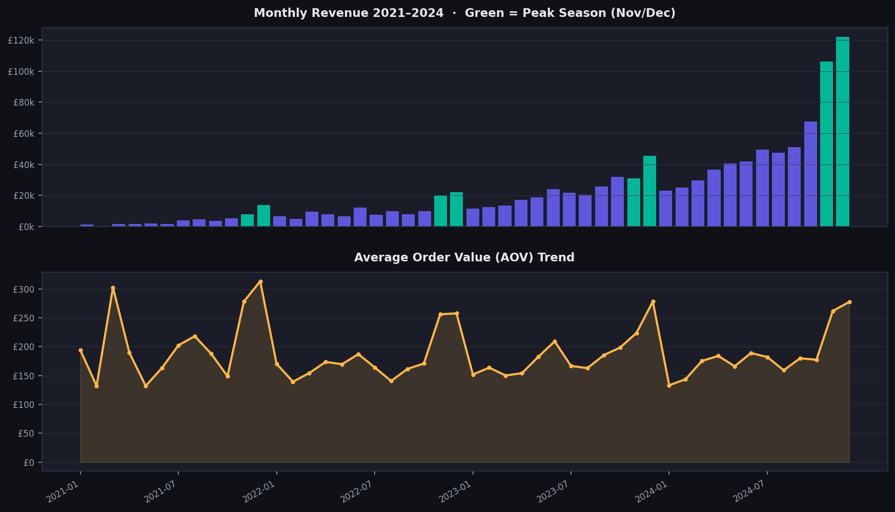
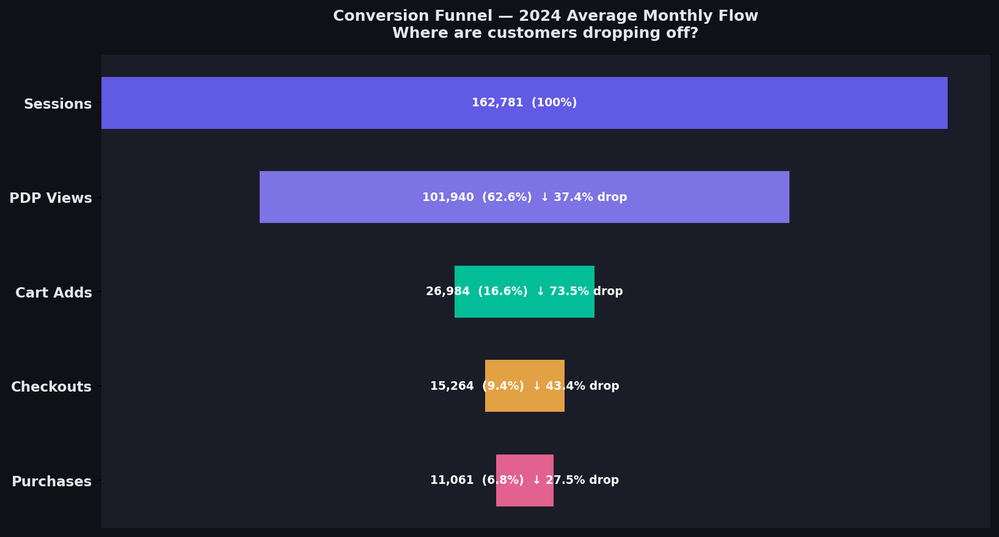
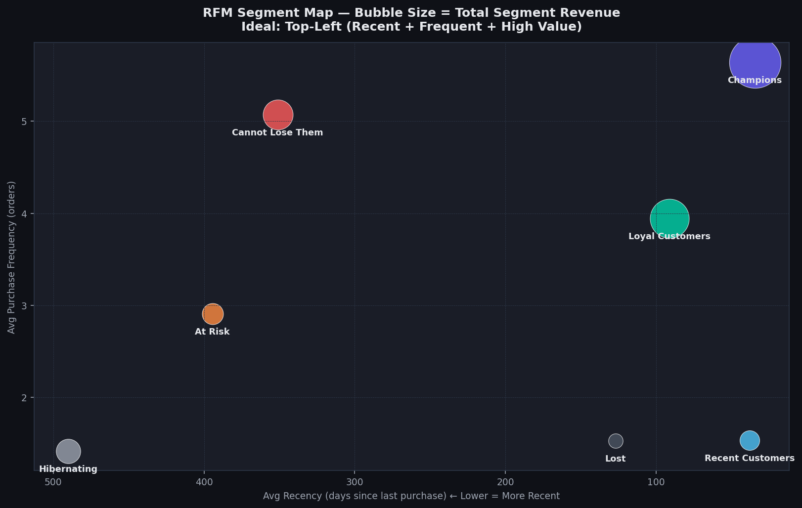
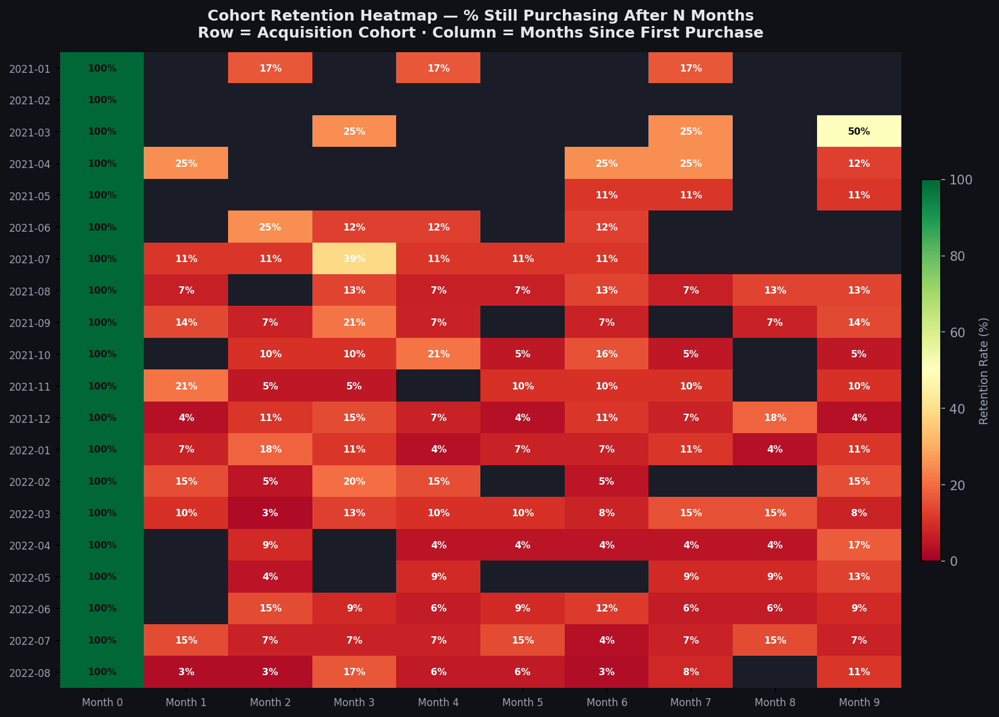
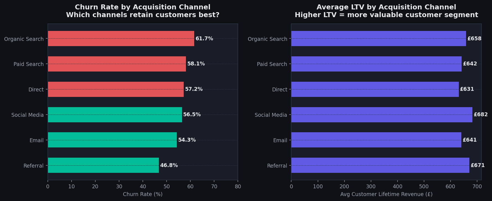
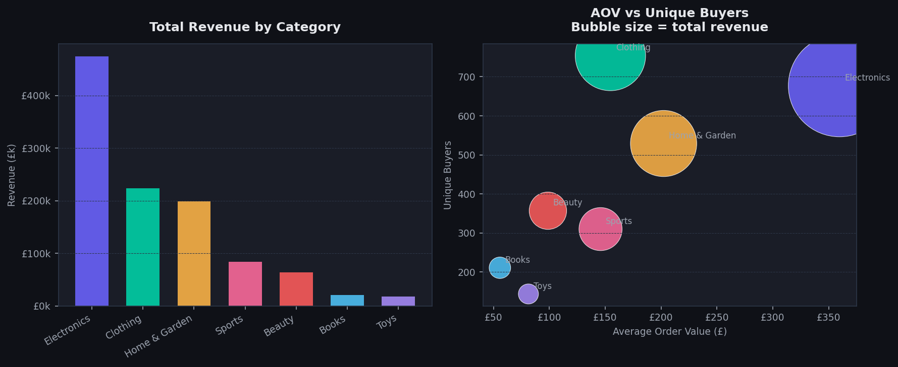
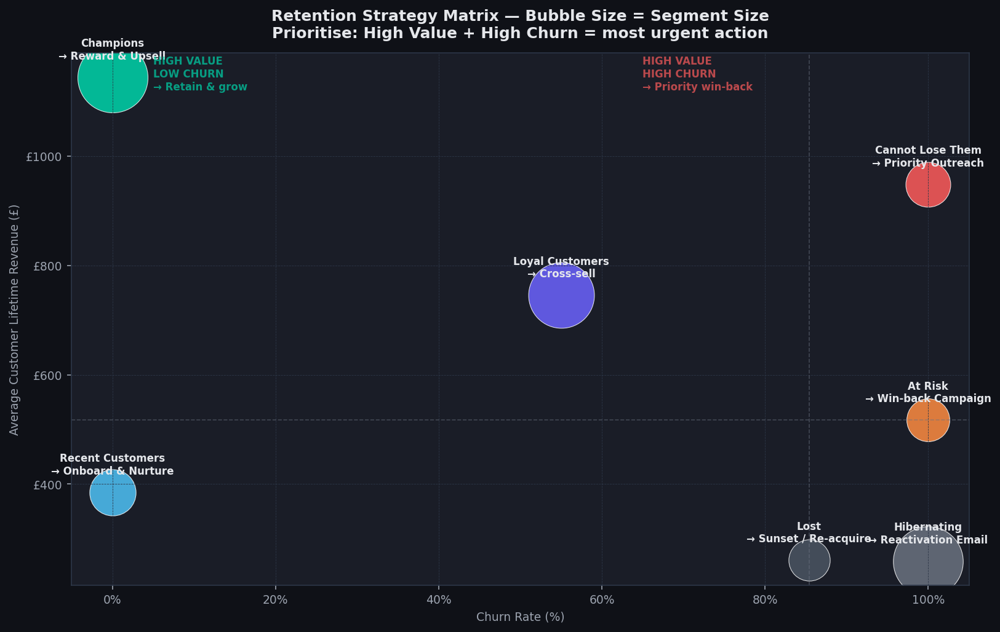

# 🛒 E-commerce Funnel & Churn Analysis — UK Retail 2021–2024

> End-to-end analysis of a simulated UK e-commerce dataset covering funnel conversion, cohort retention, RFM segmentation, churn prediction, and data-backed retention strategy recommendations.

---

## 🔴 Live Dashboard

[(https://RidhimaGupta4.github.io/Ecommerce-Churn-Analysis/)

---

## 📌 Project Summary

This project answers five core business questions every UK e-commerce company faces:

> **1. Where in the purchase funnel are we losing customers — and how much does it cost?**
>
> **2. What % of customers from each cohort are still buying 3, 6, 12 months later?**
>
> **3. Which customers are about to churn — and which are too valuable to lose?**
>
> **4. Which acquisition channels produce customers who actually stick around?**
>
> **5. What specific actions should we take, for which segments, in what order?**

Built on 5,566 orders, 2,000 customers, 48 months of data (2021–2024).

---

## 🗂️ Repository Structure
```
ecommerce-churn-analysis/
│
├── scripts/
│   ├── 01_generate_data.py        # Full synthetic UK e-commerce data pipeline
│   ├── 02_analysis_queries.sql    # 12 SQL queries (SQLite / DuckDB / PostgreSQL)
│   └── 03_eda_analysis.py         # EDA + chart generation (7 dark-themed charts)
│
├── data/
│   └── processed/
│       ├── customers.csv               # 2,000 customers with acquisition metadata
│       ├── orders.csv                  # 5,566 orders with category, channel, device
│       ├── funnel.csv                  # 48 months of funnel stage metrics
│       ├── cohort_retention.csv        # Month-0 to Month-11 retention per cohort
│       ├── rfm_segments.csv            # RFM scores + segment labels per customer
│       ├── churn_features.csv          # ML-ready feature table with churn label
│       ├── monthly_kpis.csv            # 48-row monthly KPI summary
│       └── dashboard_data.json         # All datasets combined for dashboard
│
├── dashboard/
│   └── index.html                 # ✅ Fully self-contained interactive dashboard
│
├── outputs/
│   ├── 01_revenue_aov_trend.png
│   ├── 02_conversion_funnel.png
│   ├── 03_rfm_segment_map.png
│   ├── 04_cohort_retention_heatmap.png
│   ├── 05_churn_by_channel.png
│   ├── 06_category_revenue.png
│   └── 07_retention_strategy_matrix.png
│
├── requirements.txt
├── .gitignore
└── README.md
```
---

## 📊 Dashboard Features

Open `dashboard/index.html` in any browser — **no installation, no server required.**

| Tab | What You See |
|---|---|
| **Overview** | Monthly revenue & AOV trend · Revenue by category · Year-on-year growth |
| **Funnel** | Interactive funnel waterfall · Conversion rate trend · Cart abandonment · Session volume |
| **Cohort** | Colour-coded retention heatmap · Retention curve · RFM segment donut |
| **Churn & RFM** | 7 RFM segment cards with actions · Churn rate by channel · LTV by channel |
| **Strategy** | 3 priority recommendation cards · Full segment action table · Revenue at stake · Optimisation opportunities |
| **Data Table** | Full 48-month KPI dataset filterable by year |

---

## 📐 Key Metrics Defined

### RFM Scoring
```
R (Recency)   = Days since last purchase  — scored 1–5  (5 = most recent)
F (Frequency) = Total number of orders    — scored 1–5  (5 = most frequent)
M (Monetary)  = Total lifetime revenue    — scored 1–5  (5 = highest value)
```
Customers are grouped into segments based on their R, F, M score combination:

| Segment | R Score | F Score | Description |
|---|---|---|---|
| Champions | ≥ 4 | ≥ 4 | Bought recently, buy often, spend the most |
| Loyal Customers | ≥ 3 | ≥ 3 | Regular buyers with solid lifetime spend |
| Recent Customers | ≥ 4 | ≤ 2 | New or recently reactivated |
| Cannot Lose Them | ≤ 2 | ≥ 4 | Used to buy a lot — now gone quiet |
| At Risk | ≤ 2 | ≥ 3 | Dropping off — need immediate attention |
| Hibernating | ≤ 2 | ≤ 2 | Low activity, long dormant |
| Lost | = 1 | = 1 | Likely churned permanently |

---

### Churn Definition
```
Churned = 1   if   days since last purchase  >  90
Churned = 0   if   days since last purchase  ≤  90
```
A 90-day window is the standard e-commerce benchmark where purchase cycles are typically monthly to quarterly.

---

### Cohort Retention Rate
```
Retention Rate (Month N) =  Customers from cohort still purchasing in Month N
                            ────────────────────────────────────────────────── × 100
                                       Cohort size at Month 0
```
---

### Overall Funnel Conversion Rate
```
Conversion Rate (%) = Purchases ÷ Sessions × 100
```
UK e-commerce average: 3–5%. This dataset achieves **6.8%** — above benchmark.

---

## 🔑 Key Findings

| Finding | Data Point |
|---|---|
| Total revenue growth 2021 → 2024 | **£46k → £640k — 1,284% increase** |
| Overall churn rate | **57.6%** of customers inactive for more than 90 days |
| Champions segment | **374 customers = 40% of all revenue (£428k)** — most critical to protect |
| Cannot Lose Them | **153 customers, £145k revenue** — highest urgency win-back target |
| Best acquisition channel by LTV | **Social Media: £682 avg LTV** |
| Worst acquisition channel by churn | **Organic Search: 61.7% churn rate** |
| Referral channel | **Lowest churn at 46.8%** — highest quality customers |
| Cart abandonment rate | **43.5%** — significantly better than UK average of ~75% |
| Checkout abandonment | **27%** — key drop-off point, fixing = ~£14k/month gain |
| Month 1 retention average | **~12%** — very steep initial drop, biggest intervention window |
| November revenue uplift | **~2.5× vs average month** — Black Friday impact |
| Repeat order rate 2024 | **78%** — up from 32% in 2021 |

---

## 🛠️ Quick Start

### 1. Clone the repository

```bash
git clone https://github.com/YOUR_USERNAME/ecommerce-churn-analysis.git
cd ecommerce-churn-analysis
```

### 2. Install dependencies

```bash
pip install -r requirements.txt
```

### 3. Generate all datasets

```bash
python scripts/01_generate_data.py
```

Creates 7 CSV files and 1 JSON in `data/processed/`.

### 4. Generate all 7 charts

```bash
python scripts/03_eda_analysis.py
```

Outputs 7 PNG charts to `outputs/`.

### 5. Open the interactive dashboard

```bash
# macOS
open dashboard/index.html

# Windows
start dashboard/index.html

# Linux
xdg-open dashboard/index.html
```

Or simply double-click `dashboard/index.html` in your file explorer.

---

### Optional — Run SQL analysis with DuckDB

```bash
pip install duckdb
```

```python
import duckdb

con = duckdb.connect()
con.execute("CREATE TABLE orders    AS SELECT * FROM read_csv_auto('data/processed/orders.csv')")
con.execute("CREATE TABLE customers AS SELECT * FROM read_csv_auto('data/processed/customers.csv')")
con.execute("CREATE TABLE rfm       AS SELECT * FROM read_csv_auto('data/processed/rfm_segments.csv')")
con.execute("CREATE TABLE churn     AS SELECT * FROM read_csv_auto('data/processed/churn_features.csv')")
con.execute("CREATE TABLE funnel    AS SELECT * FROM read_csv_auto('data/processed/funnel.csv')")
con.execute("CREATE TABLE kpis      AS SELECT * FROM read_csv_auto('data/processed/monthly_kpis.csv')")
con.execute("CREATE TABLE cohort    AS SELECT * FROM read_csv_auto('data/processed/cohort_retention.csv')")

# RFM segment revenue breakdown
print(con.execute("""
    SELECT rfm_segment,
           COUNT(customer_id)                                           AS n_customers,
           ROUND(AVG(monetary), 2)                                     AS avg_ltv,
           ROUND(SUM(monetary), 0)                                     AS total_revenue,
           ROUND(SUM(monetary) * 100.0 / SUM(SUM(monetary)) OVER(), 1) AS pct_of_revenue
    FROM rfm
    GROUP BY rfm_segment
    ORDER BY avg_ltv DESC
""").df())
```

All 12 queries are in `scripts/02_analysis_queries.sql`.

---

## 🗃️ Dataset Schema

### `orders.csv` — 5,566 rows

| Column | Type | Description |
|---|---|---|
| `order_id` | string | Unique order identifier |
| `customer_id` | string | Customer reference |
| `order_date` | date | Order placement date |
| `year` / `month` / `quarter` | int | Temporal breakdowns |
| `category` | string | Product category (7 categories) |
| `quantity` | int | Items ordered |
| `unit_price` | float | Pre-discount price per unit (£) |
| `discount_pct` | float | Discount applied (0 to 0.25) |
| `revenue` | float | Final order revenue (£) |
| `channel` | string | Acquisition channel |
| `device` | string | Device type (Mobile / Desktop / Tablet) |
| `region` | string | UK region |
| `is_repeat` | int | 1 if not the customer's first order |

---

### `rfm_segments.csv` — one row per customer

RFM scores (1–5 each), segment label, recency in days, frequency, total monetary value, average order value, number of categories purchased, and acquisition metadata.

---

### `churn_features.csv` — ML-ready feature table

Binary churn label (1 = inactive >90 days), all RFM features, purchase rate per month, `is_high_value` flag, `is_frequent` flag. Ready for use directly in scikit-learn or XGBoost.

---

### `cohort_retention.csv`

Cohort month, period number (0–11), number of customers still active, cohort size, retention rate %. Suitable for direct use in a pivot table or heatmap.

---

## 📈 SQL Queries Included

| Query | Purpose |
|---|---|
| `01` — Revenue YoY | Annual growth in revenue, AOV, repeat rate, revenue per customer |
| `02` — Funnel Conversion | Stage-by-stage conversion rates by year |
| `03` — Peak Season | Nov/Dec vs Summer vs rest of year — conversion and abandonment |
| `04` — RFM Revenue | Segment contribution to total revenue with percentage share |
| `05` — Churn by Channel | Which channels produce the most loyal customers |
| `06` — Churn by Segment | Churn rate and revenue per RFM segment |
| `07` — Cohort Pivot | Month 0 to Month 11 retention rate pivot table |
| `08` — Category Analysis | Revenue, AOV, discount rate, items per order by category |
| `09` — Repeat Purchase Gap | Time between first and second purchase — key retention window |
| `10` — High Value Profile | Top 25% vs bottom 25% customer comparison |
| `11` — Win-Back Targets | Prioritised list of at-risk high-value customers to contact |
| `12` — Seasonality | Monthly revenue and conversion seasonality pattern |

---

## 🔗 Data Sources & Benchmarks

| Benchmark | Source | Value Used |
|---|---|---|
| UK e-commerce conversion rate | ONS / Statista | 3–5% average |
| Cart abandonment rate | Baymard Institute | ~75% global average |
| Average order value UK | ONS Retail Sales | £65–£85 typical range |
| RFM segmentation methodology | Harvard Business Review | Standard RFM framework |
| Churn definition (90-day) | Industry standard | E-commerce benchmark |

---

## 🧰 Tech Stack

| Tool | Version | Role |
|---|---|---|
| Python | 3.10+ | Data pipeline and analysis |
| pandas | 2.0+ | Data manipulation and transformation |
| numpy | 1.24+ | Numerical computation |
| matplotlib | 3.7+ | Static chart generation (dark theme) |
| Chart.js | 4.4.1 | Interactive dashboard charts |
| HTML / CSS / JavaScript | — | Self-contained single-file dashboard |
| SQL | DuckDB / SQLite / PostgreSQL | 12 analytical queries |

---

## 💼 Skills Demonstrated

- ✅ End-to-end e-commerce analytics — funnel, cohort, RFM, and churn all in one project
- ✅ RFM segmentation from scratch — custom scoring, segment labelling, business action mapping
- ✅ Cohort analysis — monthly retention heatmap, retention curve, drop-off identification
- ✅ Churn feature engineering — binary labelling, purchase rate, lag variables, ML-ready output
- ✅ Business recommendation framing — every finding tied to a specific action with £ impact estimate
- ✅ SQL depth — 12 queries covering YoY, cohort pivot, repeat purchase gap, high-value profiling
- ✅ Dark-theme data visualisation — professional e-commerce analytics aesthetic

---

## 🖼️ Chart Gallery

### Revenue & AOV Trend 2021–2024


### Conversion Funnel — 2024 Monthly Average


### RFM Segment Map — Bubble Size = Revenue


### Cohort Retention Heatmap


### Churn Rate & LTV by Acquisition Channel


### Category Revenue & AOV


### Retention Strategy Matrix


---

## 📄 Licence

MIT — free to use and adapt
---

## 🙋 Author

Built as a UK data analyst / data scientist portfolio project.

**Connect:** [LinkedIn](https://www.linkedin.com/in/ridhimagupta1623/) · [GitHub](https://github.com/RidhimaGupta4) 

> If this project helped you, please ⭐ star the repo — it helps others find it.
